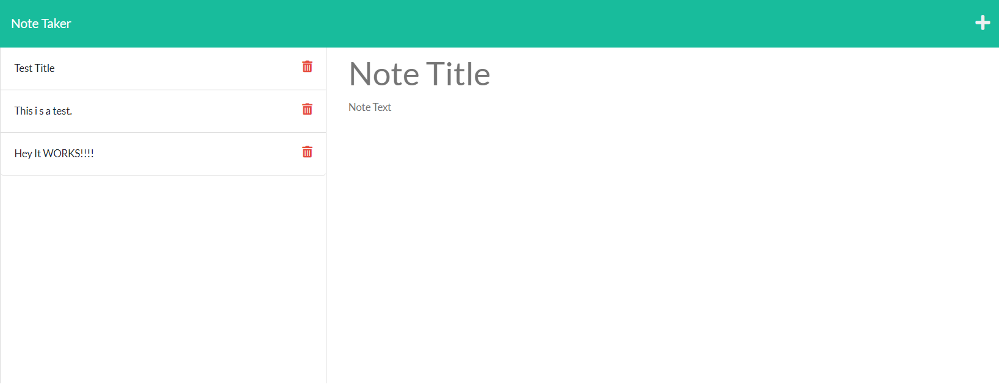

# note-taker

 ## Table of Contents

- [Description](#overall-description)
- [Installation](#installation-instructions)
- [Instructions/How To Use](#instructions/how-to-use)
- [License](#license)
- [Contribution](#contribution-guidelines)
- [Tests](#application-tests)
- [Contact Information](#contact-information)

 ## Overall Description 

Module 11 challenge making use of Express JS and Node JS to create a simple web based note taking application.

 

 ## Installation Instructions
This application runs in-browser and therefore does not require any client-side installation to be performed. However if you would like to run this application locally or you would like to expand on its codebase as a framework for your own application you will need express.js node.js and i would recommend nodemon, although it is not necessary.

 ## Instructions/How To Use
  Its pretty simple actually, to add a note, type in a title and a body and hot the save icon, to delete a note hit the trashcan next to the note you would like deleted. 
  For right now this whole project is really more of a proof of concept as there no login functionality or a way to differentiate between who put which notes where or a way to control who has access to the notes or the ability to add/delete the notes. 
  That functionality is planned in the future but for right now this is just a proof of concept type application. 

 

 ## Contribution Guidelines
 If you would like to contribute to the project, feel free to do so. Some things to keep in mind:

 1. Please use structured/formatted commit messages that adhere to the following guideline: git commit -m "{the date of the commit}" -m "{detailed description of the changes}" -m "{who is making the commit}"
 for now this is just a personal preference to keep the repository nice and tidy, eventually these guidelines will be updated to reflect whatever version nomenclature i decide to use. 

 2. Do Not open a pull request on the main branch, it will be denied. period. Start a new feature branch or open a pull request to develop so your contributions can be reviewed first. 

 3. Comment your code, since I didn't write your code i might not know right away what it does. Please keep your code clean, tidy, and well commented to make integration of features more seamless. 

 4. if you'd like to be a regular contributor reach out and ask to be a collaborator, 

 ## Application Tests

## license
  This project is licensed under the MIT license.
  For more information about this license and what it entails visit: https://opensource.org/licenses/MIT

 ## Contact Information
I hope you enjoy the application, if you have any questions, comments, concerns, feedback, ect, 
please open a new issue or feel free to reach out directly, my email for this project is vincent@vtportfolio.net
Don't forget to check out some of my other projects on github while your here: https://github.com/cobalt88